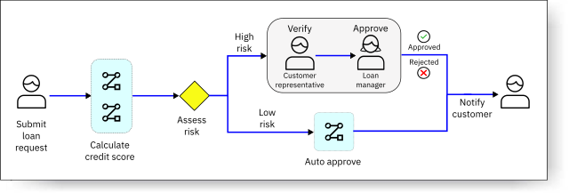
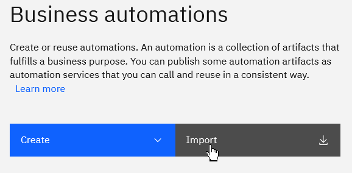
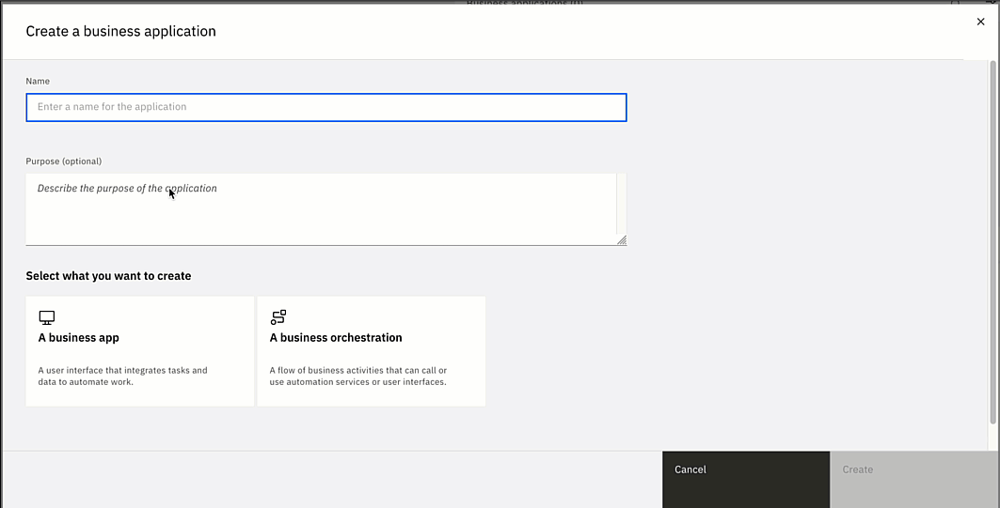
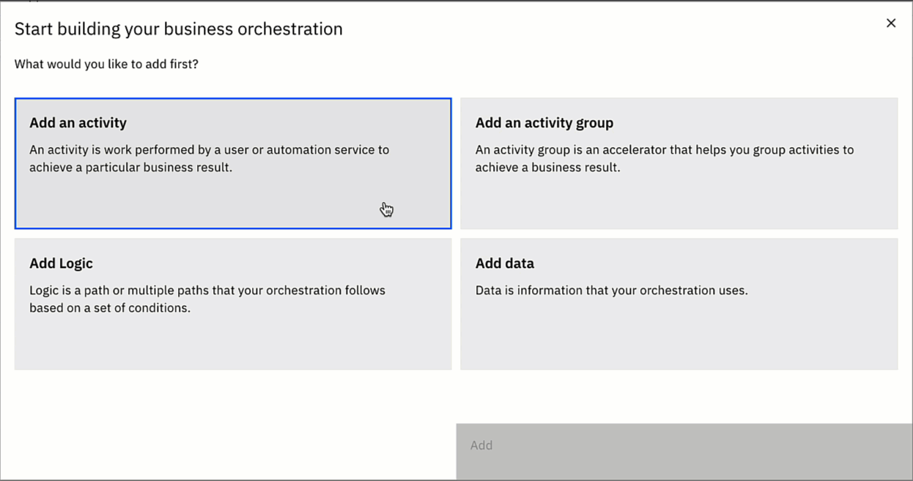
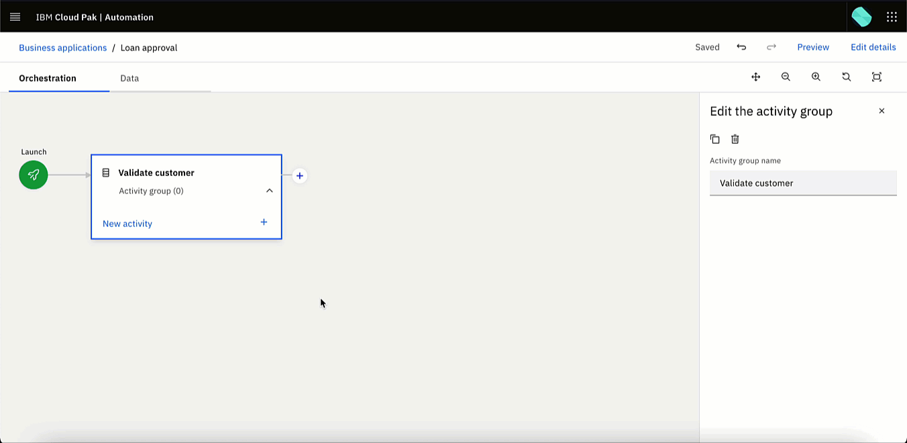
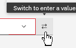
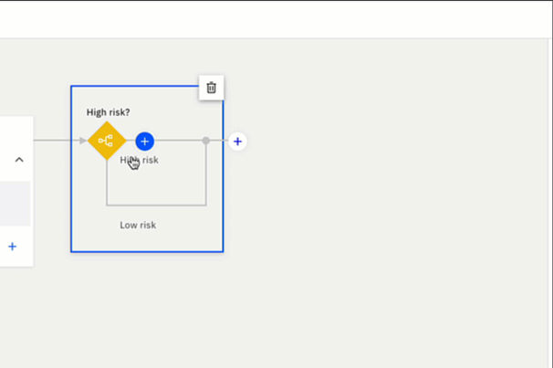
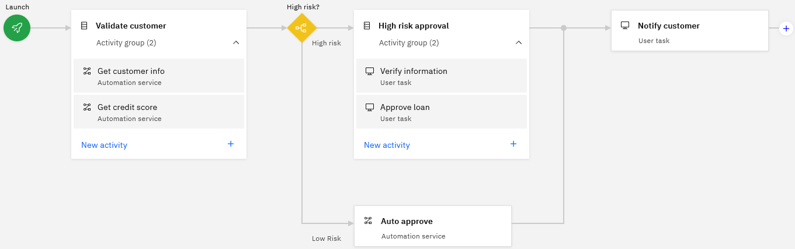
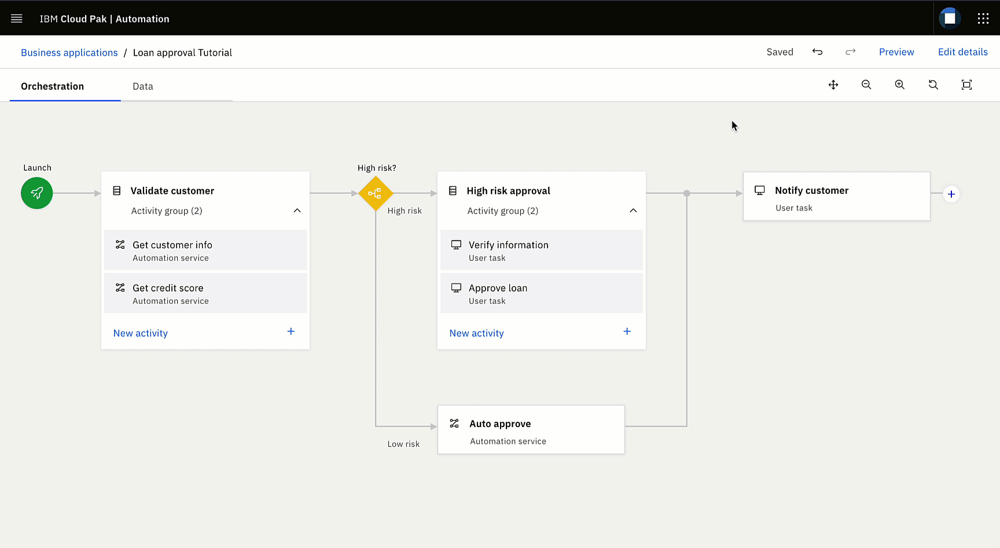

# Tutorial: Create a reusable no-code solution with business orchestration (technology preview)

Business Orchestration is introduced as a technology preview in IBM Cloud Pak for Business Automation 22.0.1.

Business applications in IBM Business Automation Studio are evolving to enable you to create no-code solutions, called business orchestrations. A business orchestration is a flow of business activities that can call automation services or can engage users. Learn how to create a no-code business orchestration that reuses business services and make it reusable. 

With just a few clicks, you can create orchestrations, call business automation services to perform logic, and specify data to display in auto-generated user interfaces. You can even publish your orchestration as a reusable automation service. 

## Table of contents

 - [Objectives](#objectives)
 - [Before you begin](#before-you-begin)
 - [Scenario](#scenario)
 - [Import the required artifacts](#import-the-required-artifacts)
 - [Create a business orchestration](#create-a-business-orchestration)
 - [Create the UI to launch your orchestration](#create-the-UI-to-launch-your-orchestration)
 - [Preview your orchestration](#preview-your-orchestration)
 - [Publish your orchestration as an automation service](#publish-your-orchestration-as-an-automation-service)
 - [More information](#more-information)

## Objectives
In this tutorial, you'll learn how to

- Import an automation and publish it as an automation service
- Create a no-code business orchestration
- Preview the orchestration
- Publish the orchestration as a reusable automation service

## Before you begin
Ask your administrator to install these starter patterns: 

- The Business Automation Application starter pattern, including the optional Business Orchestration component.
- The Business Automation Workflow Authoring and Automation Workstream Services starter pattern. Only the Business Automation Studio component is required.

For information on how to install these patterns, see [Installing a CP4BA multi-pattern starter deployment](https://www.ibm.com/docs/SSYHZ8_22.0.1/com.ibm.dba.install/op_topics/tsk_installing_cp4ba_starter.html).

## Scenario
A business analyst automates the approval or rejection of a loan application.

<kbd></kbd>

## Import the required artifacts
For this tutorial, you'll import a workflow automation and publish it as an automation service that you'll use in your orchestration. An automation service is a collection of reusable business services and operations that are published. You discover and reuse the operations in the same way regardless of how they are implemented.

1. Download the [Customer Loan Eligibility workflow automation](Customer_Loan_Eligibility.twx) to a folder on your computer.
2. Log in to IBM Cloud Pak for Business Automation.
3. Import the workflow automation: 
   
   a. Open the navigation menu on the upper left, expand **Design**, and click **Business automations**.

   b. In the Business automations page, click **Import**. Go to the folder where you put the .twx file and import it.
   
     <kbd></kbd>     
     
      The workflow automation you imported appears in the list of workflows. Now you must publish the workflow automation as an automation service so that you can discover and use it in your business orchestration.   

4. Publish the workflow automation as an automation service: select **Workflow**, click in the grey area of the **Customer Loan Eligibility** tile and, under **Automation services**, select **Publish**.

    <kbd></kbd>
   
Your automation service is now in the list of published services and you're ready to create your orchestration.

## Create a business orchestration
To create a business orchestration, 

1. Open the navigation menu on the upper left, expand **Design**, and click **Business applications**.

2. On the Business applications page, click **Create > Application**:

   Here you can choose to create a business app (user interface) or a business orchestration (a flow of business activities that can call automation services or can engage users). For the purpose of this tutorial, you'll create a business orchestration.
   
 3. Name your business application and, optional, provide a description to explain its purpose. 
 
 4. Click **A business orchestration**. 
 
     <kbd> </kbd>
 
 5. Start building your business orchestration.
   
    You can start with any of these options. You might choose **Add data**, for example, if you've already planned the data that your orchestration will need and use. For the purpose of this tutorial, click **Add an activity group**, to accelerate the creation of your orchestration by grouping activities. Activities within a group run sequentially from top to bottom. You can move the activities up or down to change the order. 
   
    <kbd></kbd>
    
6. An activity group appears on the diagram. Name the activity group `Validate customer`. 

7. Add an activity in the **Validate customer** activity group and name it `Get customer info`. When you add an activity, it's added as a user task type. Change the activity type to **Automation service**. You'll create a user task activity later in the tutorial.

   <kbd></kbd>
   
8. Under **Automation activity**, click **Select** and select the **Customer Loan Services** automation service and the **getCustomerInfo** operation. 

   When you select an operation, the operation and its parameters (data structure) are imported into your orchestration.

9. Click **Define the mapping** and map the orchestration data to the inputs and outputs of the operation. 

   The inputs are the data items that the orchestration passes to the operation. After the operation completes, it passes the resulting output data back to the orchestration. A data item represents a unit of data in the orchestration. Data items are based on data types, which define the structure and restrictions of a unit of data.

   a. Map the input data. In the field beside **givenName**, open the drop-down menu and add a new data item. The name givenName and type Text are prefilled for you. Keep the suggestions and click **Add**. Similarly, map the input data item **surname** to a new data item called `surname`.
   
   <kbd> </kbd>
      
   b. Map the output data item customerInfo. In the drop-down menu, add a new data item called `customerInfo`and select **customerInfo** as the type. 
   
   The customerInfo data type is a composite data type, which defines a group of related attributes that can be either composite or simple data types. Save your changes.
   
10. Add another activity, name it `Get credit score`, and select **Automation service**  as the activity type. The automation service is **Customer Loan Services** and the operation is **getCreditScore**. Now map the input **customer** to the **customerInfo** data item and map the output **creditScore** to a new data item called `creditScore`. Save your changes.

    **Tip:** To work faster on your own orchestrations, hover over an activity to duplicate it. <kbd> </kbd>

### Add the logic, conditions, and paths 
Add the logic that decides how the loan approval is handled. Based on the customer’s credit score and yearly income, the loan is determined to be high risk or low risk and routed to the appropriate path.

1. Add the logic, conditions, and activities to the paths. Click the + (plus) beside the activity group. Select **New logic** and edit the logic by entering `High risk?` as the name. Now name Path 1 `High risk` and Path 2 `Low risk`. Edit the conditions for the logic. Route the path to **High risk** if any of the following conditions are true:
   - If **credit score** is less than 700    
   - If **yearlyIncome** in customerInfo is less than loanAmount. You'll need to add a new data item called `loanAmount` of type Decimal. 
      
      **Tip:** To enter a value, click the **Switch to enter a value** button. <kbd> </kbd>
   
   <kbd></kbd>
   
   If the loan is determined to be high risk, a customer representative verifies the information, flags errors, and then a loan manager approves or rejects the loan. 
  
2. Add the path details. Hover over the **High risk** path and click the + (plus). Add an activity group and name it `High risk approval`. Add two activites in the group and name them `Verify information` and `Approve loan`. Because these activities are performed by users, keep the default type of user task.  
     
     <kbd></kbd>
     
3. Select the **Verify information** user task activity and then click **Define the user task**. Choose the following data items to display in the generated user interface: givenName, surname, customerInfo, and loanAmount. You need another data item called errors, which is not on the list. Complete the user task definition to save what you've got so far.  

4. Back in the orchestration, click **Data**, and create a data item called `errors` of type Boolean.

5. Return to editing the user task for the Verify Information activity. Add errors to the data items to display. Specify the layout. Move the data items until they are in the order you want. Mark all the data items except **errors** as read-only. Click **Done**.

6. Click **All users**. Add a user role called `Customer representative` and assign the activity to this user role.

7. Set the activity to be due in 1 hour.

8. In the same way, edit the Approve loan activity. Select the following data items to display in the generated user interface: givenName, surname, customerInfo, loanAmount, errors, and approved (create a new data item called approved of type Boolean). Mark all the fields except **approved** as read-only. Create a user role called `Loan manager` and assign the activity to this user role.
   
If the loan is determined to be low risk, an automation service activity automatically approves the loan:

1. Add an automation service activity to the Low risk path, and name it `Auto approve`. 

2. Select the Customer Loan Services automation service and the approveLoan operation. Map the inputs: Customer to customerInfo, loanAmount to loanAmount, and creditScore to crediScore. Map the output approved to approved.

3. Add a `Notify customer` user task activity to the right of the logic group. Select the data to be displayed: givenName, surname, loanAmount, and approved. Mark all the data items read only.
  
## Create the UI to launch your orchestration  

You can launch an orchestration as a user interface (where a business user enters the data that is passed to the orchestration), an automation service, or both. Here, you're launching it as a user interface so that you can enter the data that will be passed to the orchestration when you preview it.

To enable someone to start the orchestration,

1. Click **Launch** . 

2. Choose to launch the orchestration as a user interface. Define the user interface: select the data items givenName, surname, and loanAmount. Assign the Customer representative role. 
       
You're done! Your completed orchestration looks like this:

  <kbd></kbd>
  
Now, you're ready to preview it to see how it works.
    
## Preview your orchestration

Preview your orchestration at anytime to get a sense for how it looks and behaves. Let's preview the high risk path of your orchestration, which allows you to experience your orchestration through the eyes of different users.

1. Click the **Preview** button in the upper-right corner.
   
   Another browser window appears, showing the Launch UI you created earlier. Here you can interact with your orchestration as if you're the user.
   
   **Note:** If a browser window doesn't appear, it might have been blocked by your browser pop-up settings. If that's the case, you'll need to allow pop-ups to preview your orchestration.
   
   <kbd></kbd>
   
2. Enter a given name and surname, and a loan amount that exceeds 125,000, and then click **Launch**.

   A task list appears in Workplace, where you can see a task named **Step: Verify information**.

3. Click the task name **Step: Verify information**, and then claim the task to work on it as a customer service representative. 

4. Review the customer information, and then click **Complete**, which will send a task to the loan manager.

5. Click the task name **Step: Approve loan**, and then claim the task. 

6. Review the information. You'll notice that the **approved** checkbox is unselected because we're in the high-risk path. Click the **approved** check box, and then click **Complete**, which will send a task to a customer service representative.

7. Click the task name **Step: Notify customer**, then claim the task to work on it.

8. Review the information, and then click **Complete**. 

9. Close the preview browser. You're all done previewing the high-risk path.

## Publish your orchestration as an automation service
If you want your orchestration to be discovered and reused by other applications and automations, publish your orchestration as an automation service:

1. Click **Launch** . 

2. Select the option to launch the orchestration as an automation service.

3. Define the automation service. Name the automations service `Loan approval service` and name the operation `approveLoan`.

4. Select the data items **givenName**, **surname**, and **loanAmount**. These data items represent your operation's input parameters. 

5. Save your changes. Your orchestration is now ready to be published.

6. Go to the Business applications page. 

7. Before you publish your orchestration, you must create a version. Click in the grey area of the **Loan approval** tile. Under   **Versions**, click **Create**. After you've created a version, you'll see the service that you created under **Automation services**. You can now publish the service, and it will appear in the list of published services.

## More information

You can use document Data types so that users can upload documents as part of the orchestration. To enable document support, install the FileNet Content Manager starter pattern. For information on how to install this pattern, see [Installing a CP4BA FileNet Content Manager starter deployment](https://www.ibm.com/docs/SSYHZ8_22.0.1/com.ibm.dba.install/op_topics/tsk_installing_content_starter.html).

Although the technology preview for business orchestrations is not accessible, there are some helpful [Business orchestration keyboard shortcuts](keyboardshortcuts.md).

For information about known issues, see the **Technology preview: Business orchestrations** section of 
[IBM Cloud Pak for Business Automation 22.0.x Known Issues](https://www.ibm.com/support/pages/node/6563243).
