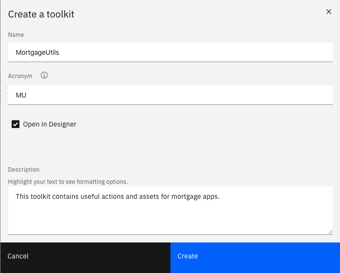
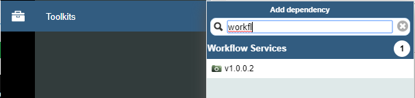
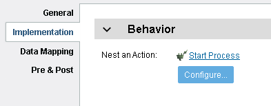
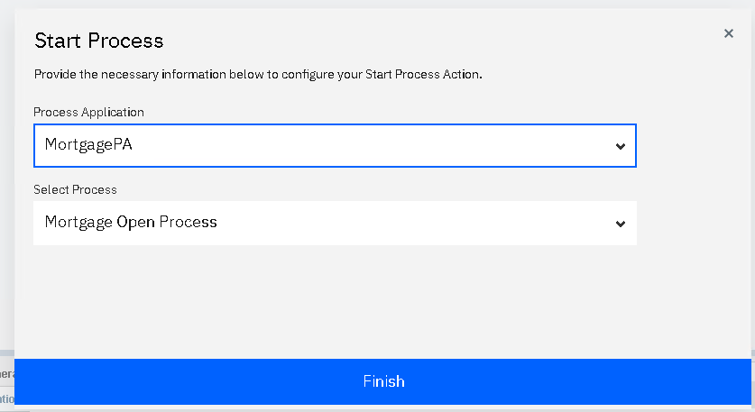
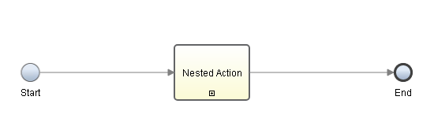
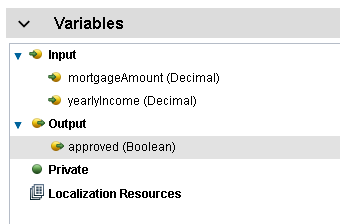
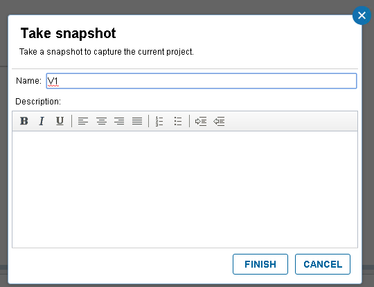
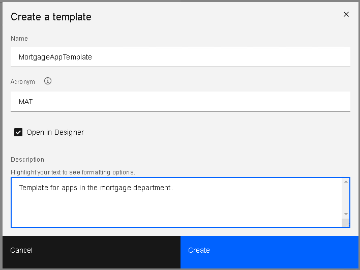

# The Provider: Creating actions and a template for the assembler to use.

In this part of the sample, the provider (a technical user) creates business-level actions for the assembler to use in their app. These actions are authored in a toolkit, allowing them to be reused in the future. The provider also creates a template as a starting point for app authoring.  The template specifies the starting point for the user interface of the app and which toolkits the app should reference.
___
**Ensure you have the MortgagePA process app imported into Workflow as indicated [here](../README.md).**
___
1. Open BAStudio and ensure the view mode in the user preferences is set to advanced.

2. In the Toolkits panel, import "CreditDeptTK - v5.twx".  This twx file has the Customer business object and an associated view. It also contains a common header used by the fictitious credit department. 

3. Create the MortgageUtils toolkit.

4. After the editor opens, add the Workflow Services toolkit as a dependency.

5. Create an action called OpenMortgageAccount.
6. In the diagram, create a nested action activity and set the implementation to call the Start Process action, which is in the Workflow Services Toolkit.

7. Press the configure button that appears under Start Process in the implementation tab of the properties.  Select MortgagePA as the process application and Mortgage Open Process as the process.  Press finish.  Note the data mappings, the variables, and the App Resource reference (in the Toolkit Settings) that are created for you.

8. Wire the start node to the Nested Action, and the Nested Action to the End node. Press the finish editing button.

9. Create a second action called IsMortgageAutoApproved.  Create the input parameters mortgageAmount (Decimal) and yearlyIncome (Decimal).  Create an output variable called approved (Boolean).

10. Create a Server Script and set the script to: "tw.local.approved = tw.local.mortgageAmount<tw.local.yearlyIncome;"
11. Wire the Start node to the script activity, and the script activity to the End node. Press the finish editing button.
12. Create a snapshot of the toolkit called V1 when finished.

13. Return to Studio and create a template called MortgageAppTemplate.

14. After the editor is opened, add MortgageUtils and CreditDeptTK as toolkit dependencies.
15. In the App, add CreditDeptTempl to the first page. Press the finish editing button.

16. Create a snapshot of the template called V1.
