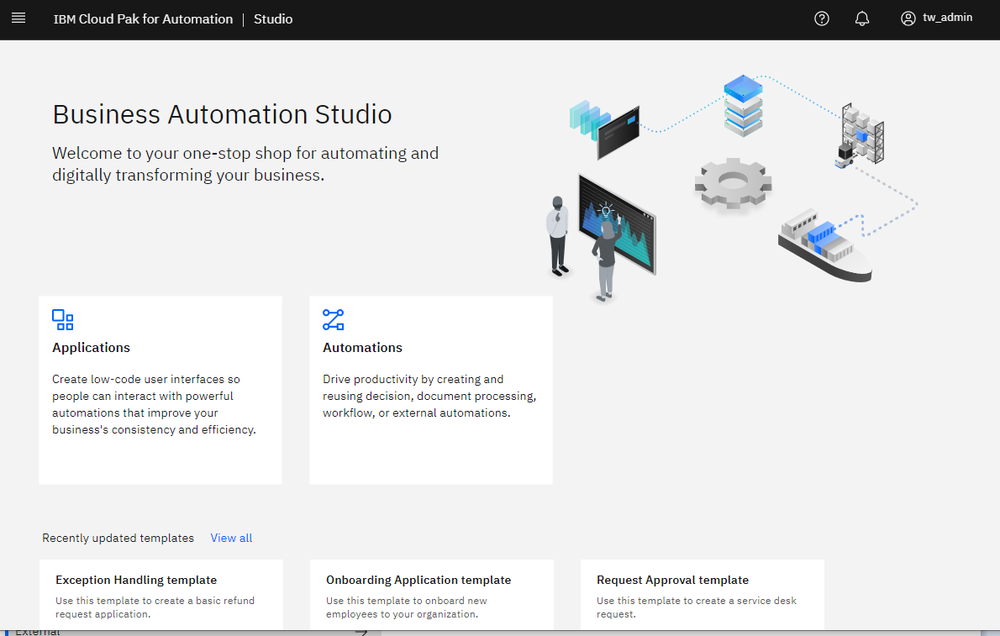
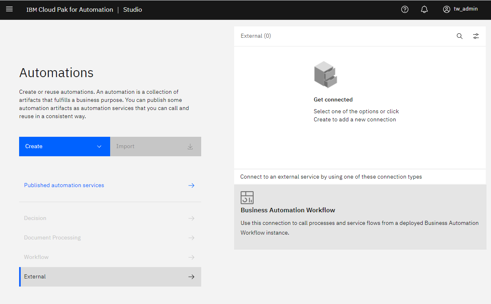
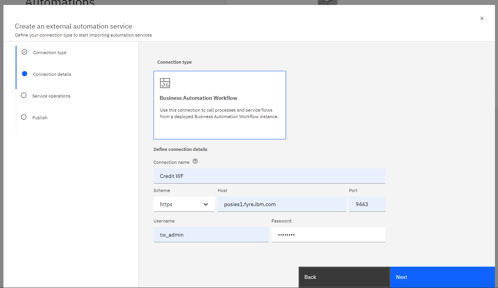
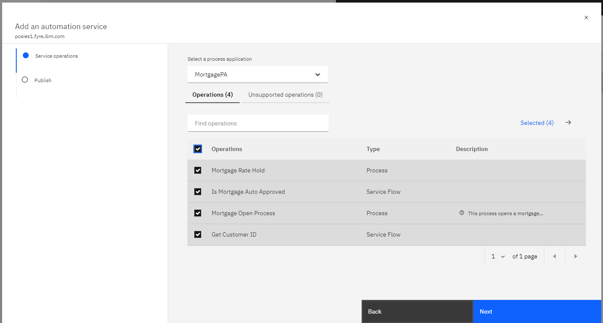
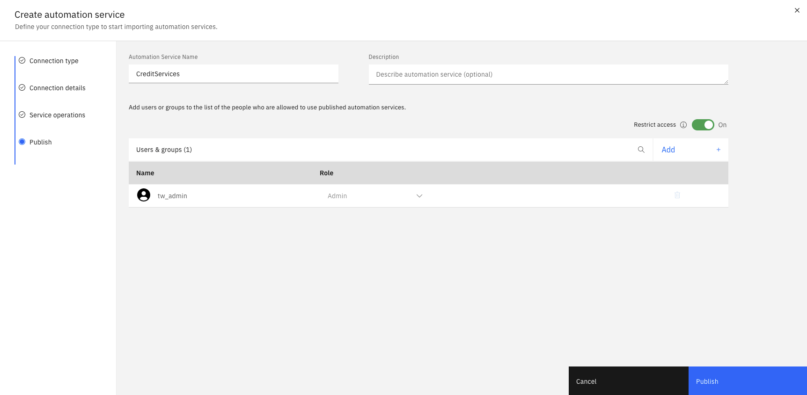
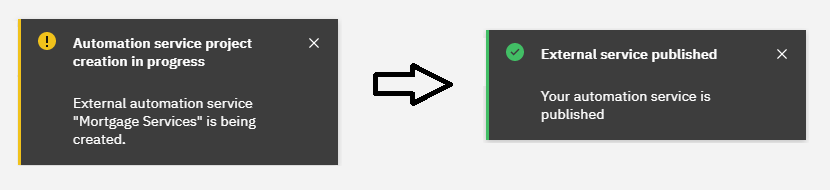
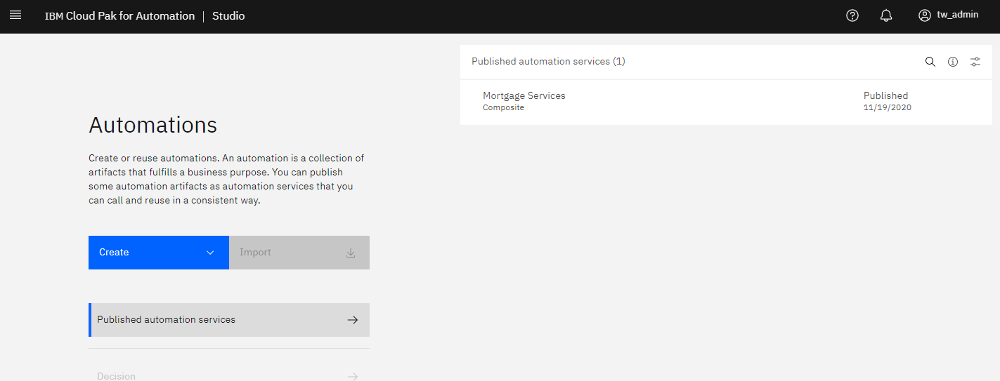
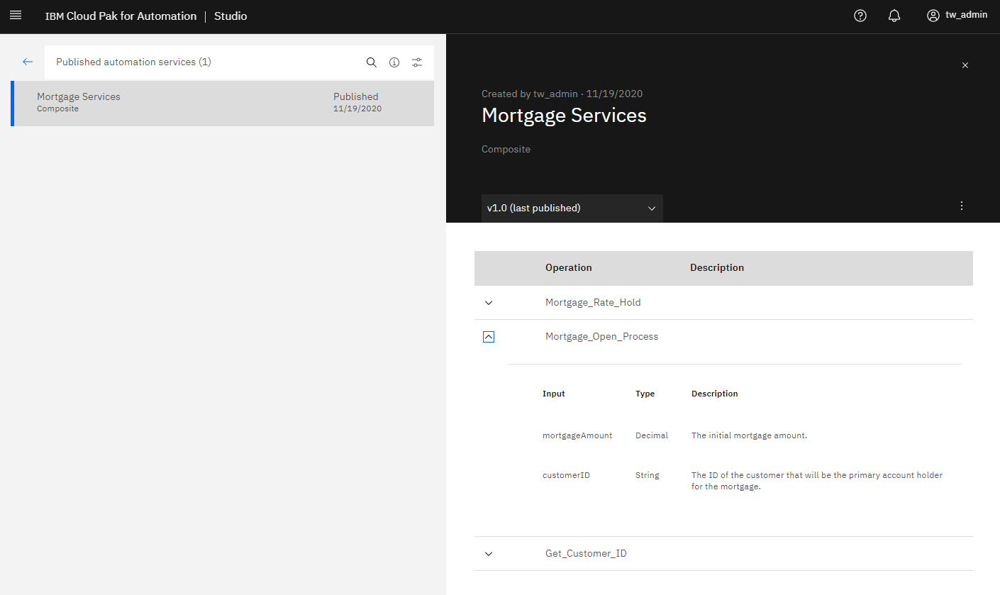
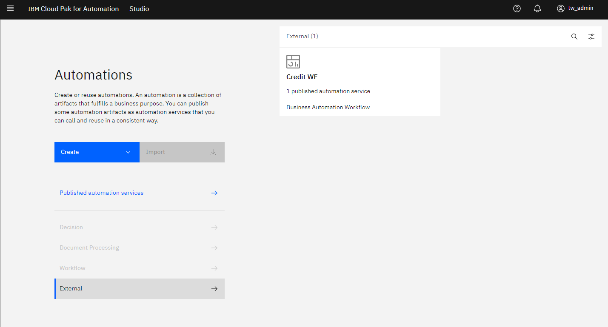
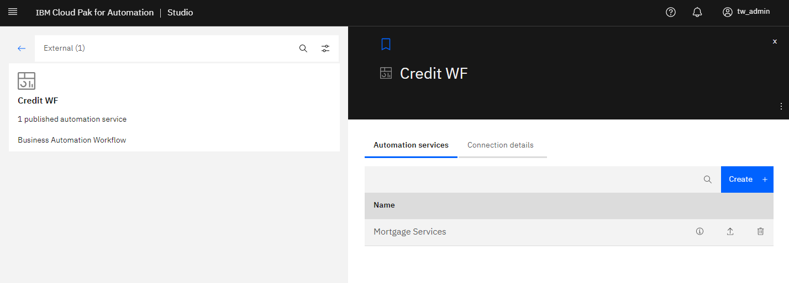

# The Provider: Creating an automation service for the assembler to use.

In this part of the sample, the provider (a technical user) creates a business-level automation service for the assembler to use in their app. These automation services are created in Business Automation Studio and are available to use by all pillars within ICP4A (Applications, workflow, decisions, etc). 
___
**Ensure you have the MortgagePA process app imported into Workflow as indicated [here](../README.md).**
___
1. Open Business Automation Studio and select the Automations tile.

  

2. In the Automation panel, select the External link. Here, you will see existing connections to external systems.  We don't have any yet, so click on the Business Automation Workflow tile.

  

3. After the wizard launches, enter the connection information about your workflow system (either a workflow center or workflow server).

  

4. After pressing the Next button, the wizard will establish a connection with the remote system and show a list of Process Apps.  Select the MortgagePA process app and choose the two processes and one serivce flow as operations to include on the resulting automation service.

  

5. Go to the next page and give the automation service a name.

  

6. Click Publish to complete the creation of the automation service. A notification will appear indicating that it is being created. When it is ready another notification will appear.

  

7. The automation service is now ready to use.  It will show up in the platform-wide catalog of published services.

  

8. Clicking on the automation service will reveal more details.

  

9. The connection is also saved for quick access to bring in more external services from the same system.

  

10. Clicking on the connection shows the automation services and allow the creation of more automation services.

  
