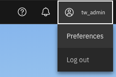
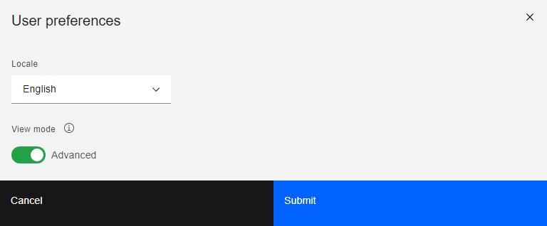
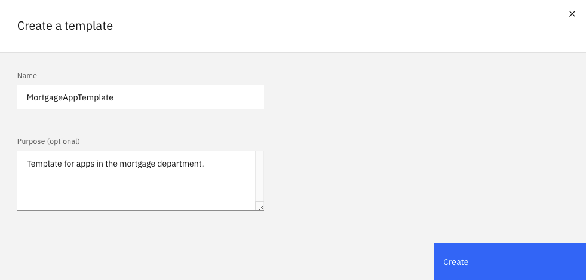
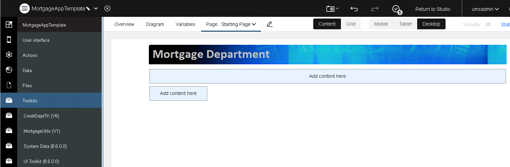

# The Provider: Creating an action and a template for the assembler to use.

In this part of the sample, the provider (a technical user) creates a business-level action for the assembler to use in their app. Ths action is authored in a toolkit, allowing them to be reused in the future. The provider also creates a template as a starting point for app authoring.  The template specifies the starting point for the user interface of the app and which toolkits the app should reference.

1. Open BAStudio and ensure the view mode in the user preferences is set to advanced.

2. In the Toolkits panel, import "CreditDeptTK - v9.twx".  This twx file has the Customer business object and an associated view. It also contains a common header used by the fictitious credit department. 

3. Return to Studio and create a template called MortgageAppTemplate.

4. After the editor is opened, add CreditDeptTK as a toolkit dependencies.
5. In the App, add CreditDeptTempl to the first page by dragging the view from the palette into the layout. Press the finish editing button.

6. Create a snapshot of the template.
