# The Assembler: Creating the Mortgage Approval App

In this part of the sample, the assembler (a business developer) creates an App leveraging a template as a starting point.
___
**Ensure you have the MortgagePA process app imported into Workflow as indicated [here](../README.md).**
___
1. Open BAStudio and ensure the view mode in the user preferences is set to basic. 

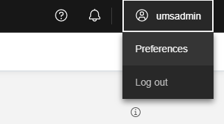

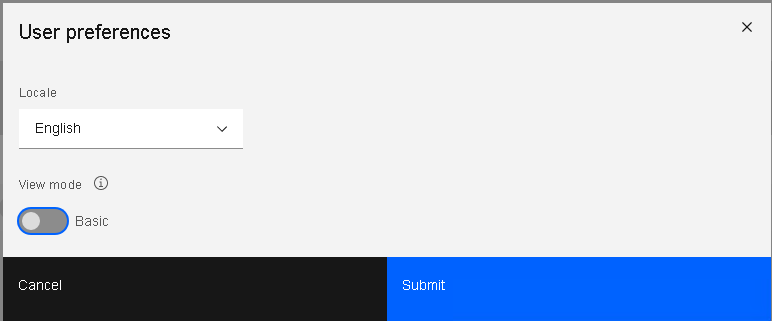

2. If you haven't performed the Create Template steps, then import the "MortgageAppTemplate - V7.twx" file.
3. Select the Applications tile on the Studio home page. Go to the template panel in the and create an App from the MortgageAppTemplate. Name the App Mortgage Approval.

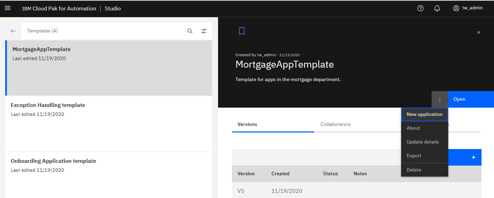  

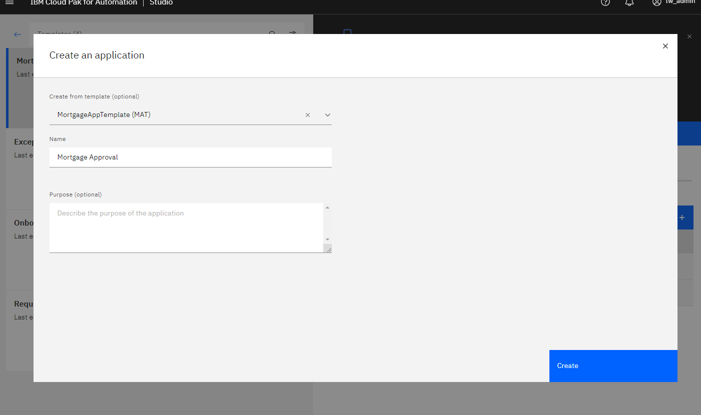  

4. The editor is opened to the first page. Add the Customer View by dragging and dropping into the upper "Drop content here" area. In the Data association dialog, create a new variable and set the variable name to "customer".

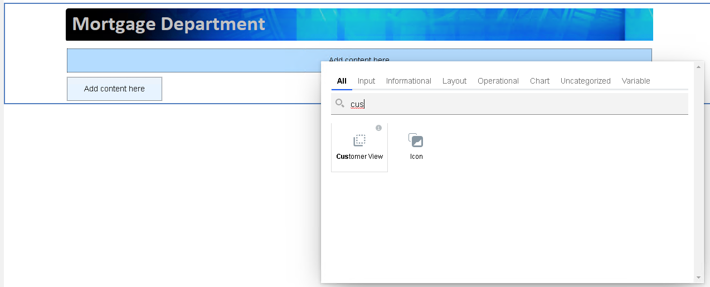

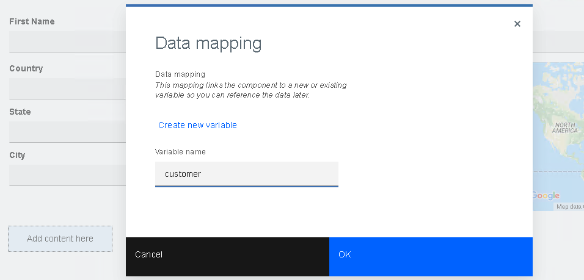  

5. To use the CreditServices automation service, choose the Automation Services palette category and click the Add button.  

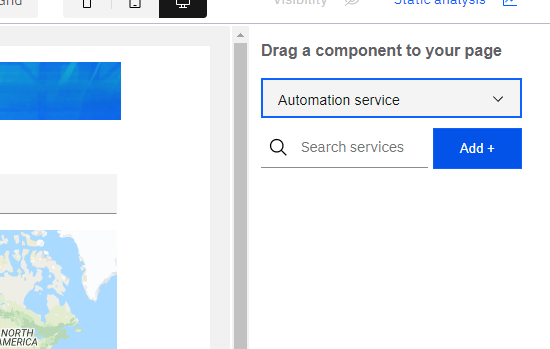 

6. The automation service catalog appears.  Choose the automation service that we created earlier and choose all operations to use in the application.

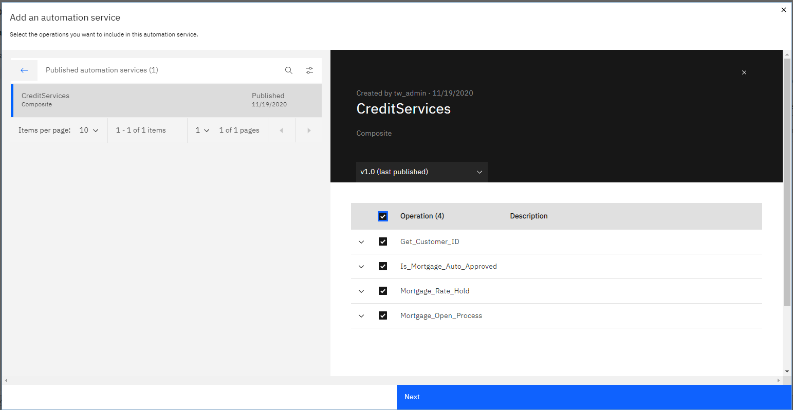 

7. Click the Next button, choose to use the default version at run time, then complete the wizard. The CreditServices automation service appears in the palette.

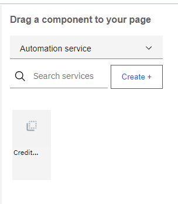 

8. We want to make a call to see if the mortgage is automatically approved.  If yes, then the associate is taken to an auto approval page. If it is not automatically approved, then the associate is take to a screen to perform additional analysis. Drag and drop CreditServices to the layout under the customer widget. An Operations dialog is presented at the top - choose the Is_Mortgage_Auto_Approved operation. Leave the defaults to create new variables for each input and output parameter.  However, choose to not create a field (by unselecting the option to Create field on page) for the output.

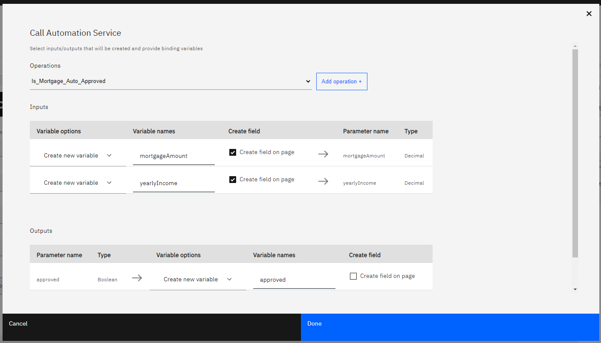  

9. The form widgets and a button are created to invoke the automation service.

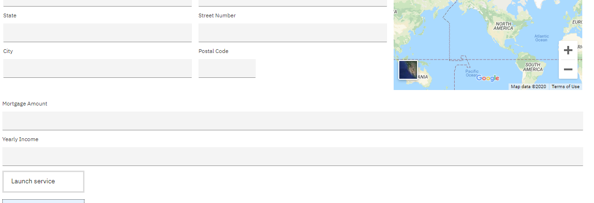  

10. Change the label of the button to "Next" using the selection toolbar.  You may optionally change its color and set an icon and move the button to the other content box.

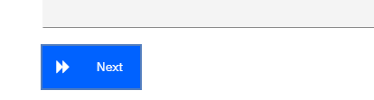  

11. To create the branching path, we will use the next step dialog for the button, launched from the selection toolbar.  In the Next step dialog that appears, click next on the first page that shows the automation service call settings. Click the plus icon to create a branching path.
12. For the top path, select Go to &lt;new page&gt; and call it "Auto Approved".  Set condition to approved==true. 
13. For the bottom path, select Go to &lt;new page&gt; and call it Risk Assessment. Unselect the option to create a navigation menu item for both paths. Complete the dialog.

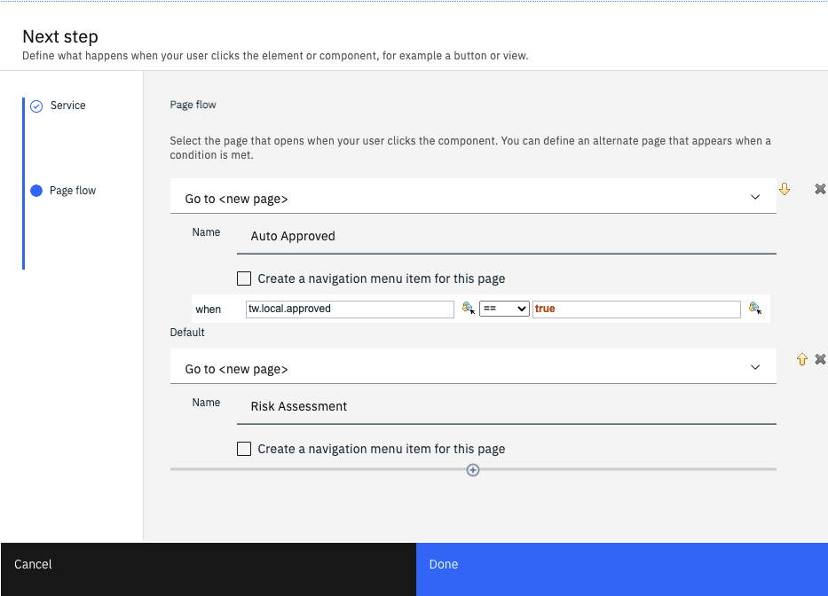

13. Go to the Auto Approved page and set the initial content to CreditDeptTemplate by dragging the view from the palette into the layout.
14. Create Display Text with the content "Mortgage is automatically approved."
15. From the palette, drag the CreditServices automation service into the layout. This time, choose the Mortgage_Open_Process operation. Ensure that the existing variables are used as the input parameters. Choose to not create fields on the page.

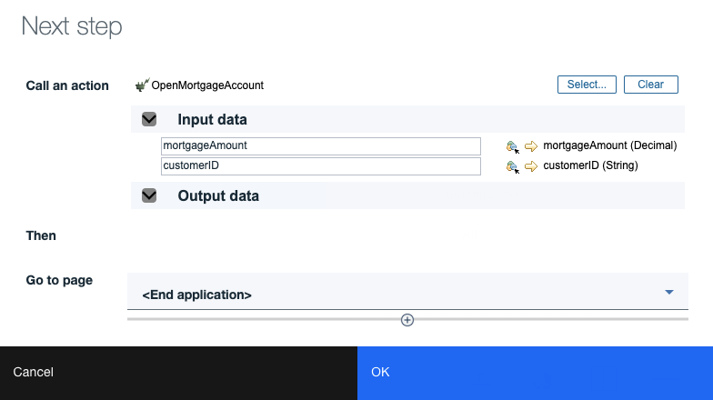  

16. Set the button label to "Open Account and Exit". You may optionally change its color and set an icon.

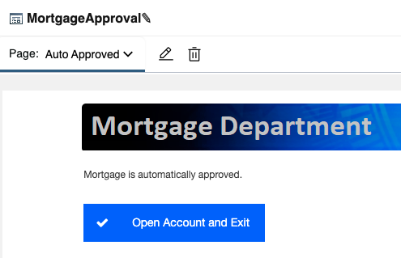  

17. Open the next step dialog and set the next step to End the application.

18. The customer ID variable is not being populated in the App yet, so go back to the Starting Page, and drag the CreditService automation service under the customer entry fields. Ensure the Get_Customer_ID operation is already selected. Choose to use the existing first name and last name variables, and choose not to create fields. Choose the existing customerID variable and create a field on the page.

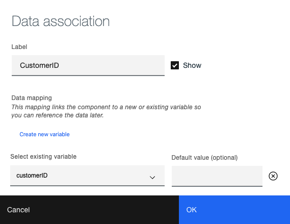

19. Change the button label to "Lookup". You may optionally change its color and set an icon.

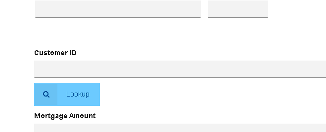

20. Go to the Risk Assessment page and set the initial content to CreditDeptTemplate.
21. We want to show the mortgage amount on this page, so the variable tab of the palette is used to select mortgageAmount.

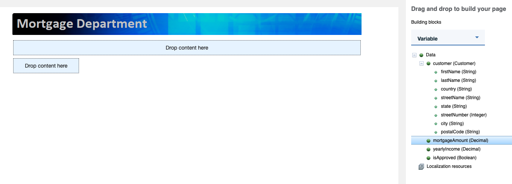

22. Add an instance of Loan Risk Charts under the mortgage amount.
23. From the palette, drag the CreditServices automation service into the layout. Choose the Mortgage_Open_Process operation. Ensure that the existing variables are used as the input parameters. Choose to not create fields on the page.

  

24. Set the button label to "Open Account and Exit". You may optionally change its color and set an icon.

  

25. Open the next step dialog and set the next step to End the application.
26. Add another new button to the right of the other. Set it to End the application.
27. Rename the button to Decline. You may optionally change its color and set an icon.

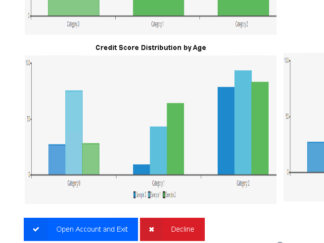

28. Now that the App is fully authored, press the Preview button in the top right corner to try it out. Use "Joe" as the first name for the customer ID lookup to work properly.
29. Once you are happy with how the app is running, return to studio.  Using the menu on the card, choose Request publish. Enter V1 for the version (snapshot) name and complete the dialog so the administrator can publish the app into production.

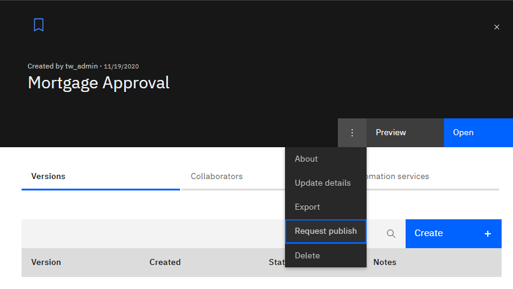
