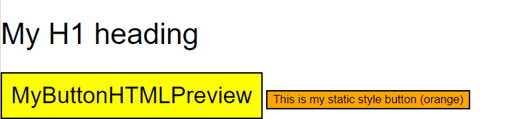
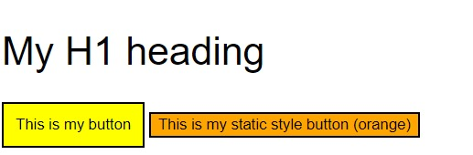
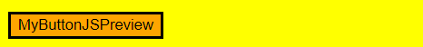
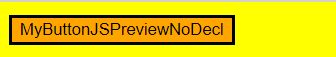
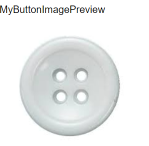

**Abstract:** This sample covers how you can leverage HTML, JS and images to create custom views. The twx file creates different views that use either html, js or both or an image to display a view.

**Details:**

- Create a view with HTML

1. Create a new view. 
2. Name this "MyButtonHTMLPreview" 
3. Under usage, check the box for 'Supports a label' 
4. For the html snippet file under advanced preview, you can either:
- attach [the HTML file for button preview with a declaration for the label of the button](./myButtonPreview.html)
- attach [the HTML file for button preview without a declaration for the label of the button](./myButtonPreviewNoDecl.html)
5. Add some CSS for the styling of the button using the classes that were added in the html file attached above. The following is an example used in the twx file:
```javascript
  .myButtonStatic{
 	background-color: orange;
 	color:black;
 }
 .myButton{
     background-color:yellow;
     padding:10px;
     font-size:20pt;
 }
```
6. This will make your view look as follows with declaraion: 

7. And without declaration:



- Create a view with JS

1. Create a new view
2. Name this "MyButtonJSPreview"
3. Under usage, check the box for 'Supports a label'
4. For the helper JS file under advanced preview, you can either:
- attach [the JS file for button preview with a declaration for the label of the button](./ButtonHelper.js)
- attach [the HTML file for button preview without a declaration for the label of the button](./ButtonHelperNoDecl.js)
5. Add some CSS for the styling of the button using the classes that were added in the JS file attached above. The following is an example used in the twx file:
```javascript
   .TestButton{
 	background-color: orange;
 	color:black;
 	border-width:3px;
 	border-style:solid;
 	background:orange;
 }
 .TestButtonDiv{
     background-color:yellow;
     padding:10px;
 }
```
6. This will make your view look as follows with declaraion: 

7. And without declaration:


- Create a view with an image
1. Create a new view
2. Name this "MyButtonImagePreview"
3. Under usage, check the box for 'Supports a label'
4. For the layout image, you can attach [the sample image of a button](./buttonPreview.jpg)
5. The view will look as follows:


- Create a view with HTML and JS
1. The UI Toolkit in the sample uses both HTML and JS for the views.

**CP4BA Version:** 22.0.2

**Prereqs:** N/A

**TWX File:** InPlaceLabelEditTest - v1.twx
