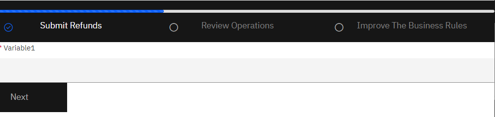
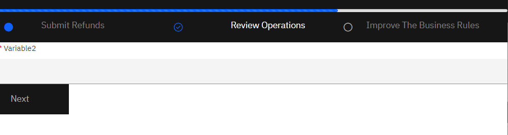
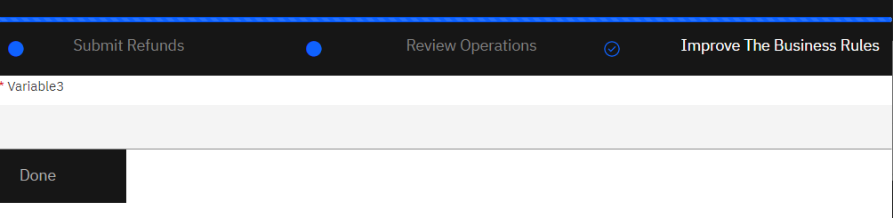

**Abstract**: This sample achieves the design of a progressive navigation bar. The navbar has 3 states for the pages:
1. Not started (represented with a greyed out circle)
2. Started (represented with a blue check mark)
3. Finished (represented with a blue filled in circle) 


The sample creates 3 pages to show the progress navbar states. The following images show the design of the navbar as you progress through each page:





**Details**:
The sample is created with the following steps: 
1. Open BAStudio
2. Create a new business app
3. Go to the Starting Page and delete the default navbar from the page.
4. Go to the Diagrams tab and DND a new common area from the widgets on the left 
5. Go to the variables tab and create a new Decimal variable. Name this variable 'furthestPage'.
8. Set the default value of this variable to 1.0
6. Go back to the Page tab and open the new common area 
7. DND a progress bar on this common area page
9. Bind this progress bar to the 'furthestPage' variable
10. Under the Positioning tab: Set padding of progress bar to ```15px 0px 0px 0px```
11. Under the Configuration tab, Behavior  dropdown: Set max value to 3
12. Under the Configuration tab, Appearance dropdown: Set height to 5px, Color to Primary and Check striped
13. Under the HTML attributes tab: Add an attribute with the following values: ```name: style, value: background-color: #161616;```
14. DND a single column grid onto the page. Add three columns within this grid. Make each cell span 4 columns.
15. DND horizontal layouts in each of the 3 columns.
16. For each horizontal layout, add an html attribute with the following values: ```name: style, value: background-color: #161616;```
17. For each horizontal layout, set margin and padding to 0 under the Positioning tab
18. For each horizontal layout, set layout flow to "Horizontal Tight" and vertical alignment to "Middle" under the Configuration tab
19. Add an html class to each horizontal layout. Name this "layoutParentMargin"
20. Add the following JS under Events --> On Load for the first horizontal layout: 
```javascript 
document.getElementsByClassName("layoutParentMargin")[0].closest(".BPMGridLayoutCell").classList.add("parentMargin")
```
21.  Add the following JS under Events --> On Load for the second horizontal layout: 
```javascript 
document.getElementsByClassName("layoutParentMargin")[1].closest(".BPMGridLayoutCell").classList.add("parentMargin")
```
22. Add the following JS under Events --> On Load for the third horizontal layout: 
```javascript 
document.getElementsByClassName("layoutParentMargin")[2].closest(".BPMGridLayoutCell").classList.add("parentMargin")
```
23. DND a display text in each horizontal layout.
24. Set the padding of each display text to `12px 0px 8px 0px`
25. Add an html class to each display text under HTML attributes tab. Name this class 'navbarText'
26. Label the first display text "Submit Refunds"
27. For the "Submit Refunds" text: Set the visibility to the script:
```javascript
if(local.get("furthestPage")==1){         document.getElementsByClassName("navbarText")[0].classList.add("navbarColor");         return "READONLY"; } return "DEFAULT";
```
28. Label the second display text "Review operations"
29.  For the "Review operations" text: Set the visibility to the script:
```javascript
if(local.get("furthestPage")==2){        document.getElementsByClassName("navbarText")[1].classList.add("navbarColor");        return "READONLY";        }return "DEFAULT";
```
30. Label the third display text "Improve the business rules"
31. For the "Improve the business rules" text: Set the visibility to the script:
```javascript
if(local.get("furthestPage")==3){        document.getElementsByClassName("navbarText")[2].classList.add("navbarColor");        return "READONLY";        }return "DEFAULT";
```
32. In the first horizontal layout, on the left of the "Submit Refunds" display text:
- DND an icon.
- Change color to Transparent
- Change icon to ci-checkmark-outline under configuration --> appearance
- Set visibility to the Rule: `Set to:None When:furthestPage Condition:Greater than Value:1 Otherwise:Read only`
- DND another icon next to the previous one. 
- Change color to Transparent. 
- Change icon to fa-circle under configuration --> appearance
- Set visibility to the Rule: `Set to:None When:furthestPage Condition:Less than Value:2 Otherwise:Read only`
33. In the second horizontal layout, on the left of the "Review operations" display text:
- DND an icon.
- Change color to Transparent
- Change icon to ci-checkmark-outline under configuration --> appearance
- Set visibility to the Rule: `Set to:None When:furthestPage Condition:Not equal to Value:2 Otherwise:Read only`
- DND another icon next to the previous one. 
- Change color to Transparent. 
- Change icon to fa-circle under configuration --> appearance
- Set visibility to the Rule: `Set to:None When:furthestPage Condition:Less than Value:3 Otherwise:Read only`
- DND another icon next to the previous one. 
- Change color to Transparent. 
- Change icon to fa-circle-thin under configuration --> appearance
- Set visibility to the Rule: `Set to:Read only When:furthestPage Condition:Less than Value:2 Otherwise:None`
34. In the third horizontal layout, on the left of the "Improve the business rules" display text:
- DND an icon.
- Change color to Transparent
- Change icon to ci-checkmark-outline under configuration --> appearance
- Set visibility to the Rule: `Set to:None When:furthestPage Condition:Not equal to Value:3 Otherwise:Read only`
- DND another icon next to the previous one. 
- Change color to Transparent. 
- Change icon to fa-circle under configuration --> appearance
- Set visibility to the Rule: `Set to:None When:furthestPage Condition:Less than Value:4 Otherwise:Read only`
- DND another icon next to the previous one. 
- Change color to Transparent. 
- Change icon to fa-circle-thin under configuration --> appearance
- Set visibility to the Rule: `Set to:Read only When:furthestPage Condition:Less than Value:3 Otherwise:None`
35. For each of the fa-circle icons:
- Go to the html attributes tab from properties
- Add an html class. Name this 'navbaricon'
36. For every icon:
- Go to the html attributes tab from properties
- Add an html class. Name this 'icon-bgblack'
37. From the left hand library manager items, create a new theme from User Interface --> Theme
38. This theme copies the existing carbon theme. Name it "ProgressTheme".
39. Add the following lines to the CSS under source tab:  
```
.navbarText > .form-group .control-label {
font-size: 14px;color: gray;
}
.navbarColor > .form-group .control-label {
color: white;
}
.navbaricon > div.disabled > span { 
color: #0f62fe;
}
.icon svg.ci { 
fill: #0f62fe
};

.parentMargin {
padding-left: 0px;    padding-right: 0px;
}

.icon-bgblack>.SPARKIcon.btn.btn-transparent.disabled:not([role="img"]) {
background: #161616 !important;
}
```
40. Go to Application Project Settings and set the page theme to "ProgressTheme".
41. Now create 3 pages and DND the common view created above onto each page. 
42. DND a variable string onto each page. Set these variables to required. 
43. Add a button on each page. Every button navigates to the next page on click for their next steps. The button on the last page ends the application. 
44. Open the diagram tab and add the following code in the pre-script of the second page:
```javascript
if (tw.local.furthestPage<2) {
  tw.local.furthestPage = 2;
}
```
45. Add the following code in the pre-script of the third page:
```javascript
if (tw.local.furthestPage<3) {
  tw.local.furthestPage = 3;
}
```

**How To Add More Pages To The Navbar:**

1. Edit the progress bar view. Under configuration --> Behavior: Set max value to the new # of pages. 
2. Go to the grid view. Add a new cell on the right of the last cell. Change the horizontal span of each cell to 12/ # of cells. (integer value. Example: 6 pages will have each cell span = 2)
3. Go back to the content view. Copy and paste the last horizontal layout into the new cell. Change the following values: 
4. The label of the display text to the name of the new page.
5. Under events --> on load of the horizontal layout, change the index value to the next higher integer.`document.getElementsByClassName("layoutParentMargin")`**`[#]`**`.closest(".BPMGridLayoutCell").classList.add("parentMargin")`
6. Go to the properties of each icon. Under visibility, change the value in the rule to be the next higher integer. (For example change a 4 to a 5).
7. Go to the properties --> visibility of the display text, and change the integer values to the next higher integer: 
`if(local.get("furthestPage")==`**`#`**`){        document.getElementsByClassName("navbarText")`**`[#]`**`.classList.add("navbarColor")        return "READONLY";}`
8. Add a new page. Name this your navbar page name. 
9. DND the common area onto this page. 
10. Edit your page like you wish.
11. Go to the diagrams tab. Add the following code into the pre-script of the new page:  (# = the number of the page)
`if (tw.local.furthestPage<`**`#`**`) {  tw.local.furthestPage = `**`#`**`;}`


	
**CP4BA Version**: 22.0.2
	
**Prereqs**: N/A
	
**Twx File**: ProgressNavBar-3Page - 1.twx
	
