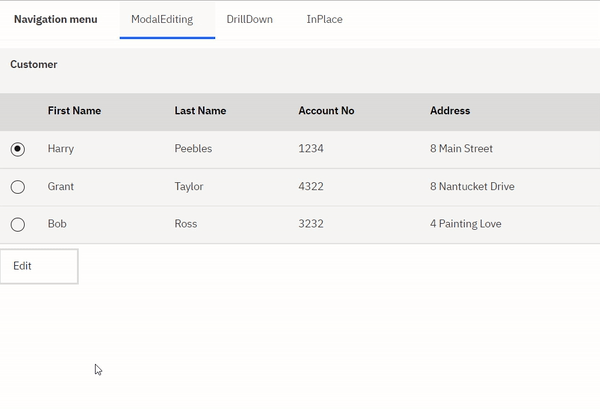
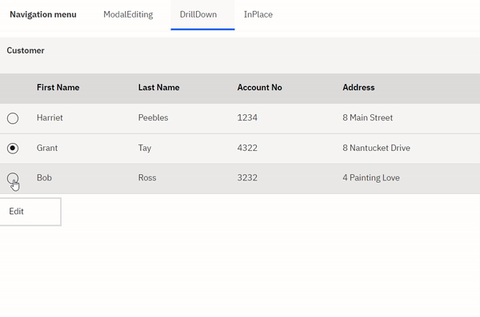
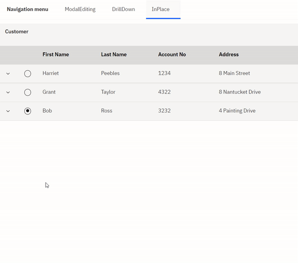

**Abstract:**
The sample covers patterns of editing tables in a modal and non-modal approach. The non-modal approach can be achieved via a drill-down or an in-place edit. While modal vs non-modal is a design choice, in place editing can be slow to render with large tables.


**Details:**

- Modal Approach:
1. Drag and drop a table onto the StartingPage. Rename this page to 'ModalEditing'
2. Create a new Business Object. Name this 'Customer'. Give it parameters: firstName(String), lastName(String), accountNo(String), address(String). 
3. Create a new variable of type 'Customer'. Make it a list. Name this 'customers'.
4. Assign this variable default values. You can use the code below as an example: 
```javascript
var autoObject = [];
autoObject[0] = {};
autoObject[0].firstName = "Harry";
autoObject[0].lastName = "Peebles";
autoObject[0].accountNo = "1234";
autoObject[0].address = "8 Main Street";

autoObject[1] = {};
autoObject[1].firstName = "Grant";
autoObject[1].lastName = "Taylor";
autoObject[1].accountNo = "4322";
autoObject[1].address = "8 Nantucket Drive";

autoObject[2] = {};
autoObject[2].firstName = "Bob";
autoObject[2].lastName = "Ross";
autoObject[2].accountNo = "3232";
autoObject[2].address = "4 Painting Love";
autoObject
```
5. Go back to the page. Bind the table to 'customers' variable. 
6. Set table selection mode to Single. 
7. From the table configuration properties, under 'Columns' dropdown, render 4 columns as 'Simple HTML'
8. Drag and Drop four plain texts into the table. 
9. Bind the plain text to: `customers.currentitem.firstName, customers.currentitem.lastName, customers.currentitem.accountNo, customers.currentitem.address`
10. DnD a button onto the page. Name this 'Edit'
11. The Edit button will take you to a new page on click. Name this page 'Modal_Edit'. Do not create a navigation menu item for this page.
12. Create a new variable of type 'Customer'. Name this 'tempCustomer'.
13. DnD 4 plain texts onto the Modal_Edit page. Bind each plain text to: `tempCustomer.firstName, tempCustomer.lastName, tempCustomer.accountNo, tempCustomer.address`
14. DnD two buttons onto this page. Name these: OK, Cancel.
15. The Cancel button takes you back to the 'ModalEditing' page.
16. The OK button takes you to a client side script. The client side script has the following code: 
```javascript
tw.local.customers.listSelected.firstName = tw.local.tempCustomer.firstName;
tw.local.customers.listSelected.lastName = tw.local.tempCustomer.lastName;
tw.local.customers.listSelected.accountNo = tw.local.tempCustomer.accountNo;
tw.local.customers.listSelected.address = tw.local.tempCustomer.address;
```
17. The client-side script directs back to the 'ModalEditing' page in the diagram tab.
18. The pre-script of the 'Modal_Edit' page has the following code: 
```javascript
tw.local.tempCustomer = {};
tw.local.tempCustomer.firstName = tw.local.customers.listSelected.firstName;
tw.local.tempCustomer.lastName = tw.local.customers.listSelected.lastName;
tw.local.tempCustomer.accountNo = tw.local.customers.listSelected.accountNo;
tw.local.tempCustomer.address = tw.local.customers.listSelected.address;
```
19. Preview. The editing should look as follows: 




- Non Modal Drill-Down
19. Drag and drop a table onto a new Page. Rename this page to 'DrillDown'
20. Create a new Business Object. Name this 'Customer'. Give it parameters: firstName(String), lastName(String), accountNo(String), address(String). 
21. Create a new variable of type 'Customer'. Make it a list. Name this 'customers'.
22. Assign this variable default values. You can use the code below as an example: 
```javascript
var autoObject = [];
autoObject[0] = {};
autoObject[0].firstName = "Harry";
autoObject[0].lastName = "Peebles";
autoObject[0].accountNo = "1234";
autoObject[0].address = "8 Main Street";

autoObject[1] = {};
autoObject[1].firstName = "Grant";
autoObject[1].lastName = "Taylor";
autoObject[1].accountNo = "4322";
autoObject[1].address = "8 Nantucket Drive";

autoObject[2] = {};
autoObject[2].firstName = "Bob";
autoObject[2].lastName = "Ross";
autoObject[2].accountNo = "3232";
autoObject[2].address = "4 Painting Love";
autoObject
```
5. Go back to the page. Bind the table to 'customers' variable. 
6. Set table selection mode to Single.
7. From the table configuration properties, under 'Columns' dropdown, render 4 columns as 'Simple HTML'
8. Drag and Drop four plain texts into the table. 
9. Bind the plain text to: `customers.currentitem.firstName, customers.currentitem.lastName, customers.currentitem.accountNo, customers.currentitem.address`
10. DnD a button onto the page. Name this 'Edit'
11. The Edit button will take you to a new page on click. Name this page 'DrillDown_Edit'. Do not create a navigation menu item for this page.
12. DnD 4 plain texts onto this page. Bind each plain text to: `customers.listSelected.firstName, customers.listSelected.lastName, customers.listSelected.accountNo, customers.listSelected.address`
13. DnD a button onto this page. Name this: Back
14. The button takes you back to the 'DrillDown' page.
15. Preview. The editing should look as follows: 



- Non Modal In-place 
1. Drag and drop a table onto the StartingPage. Rename this page to 'NoSubmitEdit'
2. Create a new Business Object. Name this 'Customer'. Give it parameters: firstName(String), lastName(String), accountNo(String), address(String)
3. Create a new variable of type 'Customer'. Make it a list. Name this 'customers'.
4. Assign this variable default values. You can use the code below as an example: 
```javascript
var autoObject = [];
autoObject[0] = {};
autoObject[0].firstName = "Harry";
autoObject[0].lastName = "Peebles";
autoObject[0].accountNo = "1234";
autoObject[0].address = "8 Main Street";

autoObject[1] = {};
autoObject[1].firstName = "Grant";
autoObject[1].lastName = "Taylor";
autoObject[1].accountNo = "4322";
autoObject[1].address = "8 Nantucket Drive";

autoObject[2] = {};
autoObject[2].firstName = "Bob";
autoObject[2].lastName = "Ross";
autoObject[2].accountNo = "3232";
autoObject[2].address = "4 Painting Love";
autoObject
```
5. Go back to the page. Bind the table to 'customers' variable. 
6. From the table configuration properties, check the 'Allow rows to expand' checkbox. 
7. From the table configuration properties, under 'Columns' dropdown, render all columns as 'Simple HTML'
8. Change the control ID of the table to 'customers1'.
9. Drag and Drop four plain texts into the table. 
10. Bind the plain text to: `customers.currentitem.firstName, customers.currentitem.lastName, customers.currentitem.accountNo, customers.currentitem.address`
11. In the expanded row area of the table, DnD four plain texts. 
12. Bind the plain text to: `customers.currentitem.firstName, customers.currentitem.lastName, customers.currentitem.accountNo, customers.currentitem.address`
13. In the events properties of the firstName plain text, in the JS script for 'on change', add the following code: 
```javascript
var context = this.context.controlidpath;
var index = context.substring(context.indexOf('['));
document.getElementById("table-item-asHTML-firstName-customers1" + index).textContent = me.getData();
```
14. In the events properties of the lastName plain text, in the JS script for 'on change', add the following code:
```javascript
var context = this.context.controlidpath;
var index = context.substring(context.indexOf('['));
document.getElementById("table-item-asHTML-lastName-customers1" + index).textContent = me.getData();
```
15. In the events properties of the accountNo plain text, in the JS script for 'on change', add the following code:
```javascript
var context = this.context.controlidpath;
var index = context.substring(context.indexOf('['));
document.getElementById("table-item-asHTML-accountNo-customers1" + index).textContent = me.getData();
```
16. In the events properties of the address plain text, in the JS script for 'on change', add the following code:
```javascript
var context = this.context.controlidpath;
var index = context.substring(context.indexOf('['));
document.getElementById("table-item-asHTML-address-customers1" + index).textContent = me.getData();
```
17. Preview. You should be able to change data in place from the plain texts in the expanded row area.



**More Patterns**: 
1. In table configuration properties, you can select 'Show Delete Button' or 'Show Add Button' which lets you add/delete rows.
2. Following similar patterns above, you can change the table selection to 'Multiple' instead of 'Single' and edit multiple rows at the same time in the modal or drill down approach. 


**CP4BA Version:** 22.0.2

**Prereqs:** N/A

**TWX File:** TablePatterns - V2.twx
